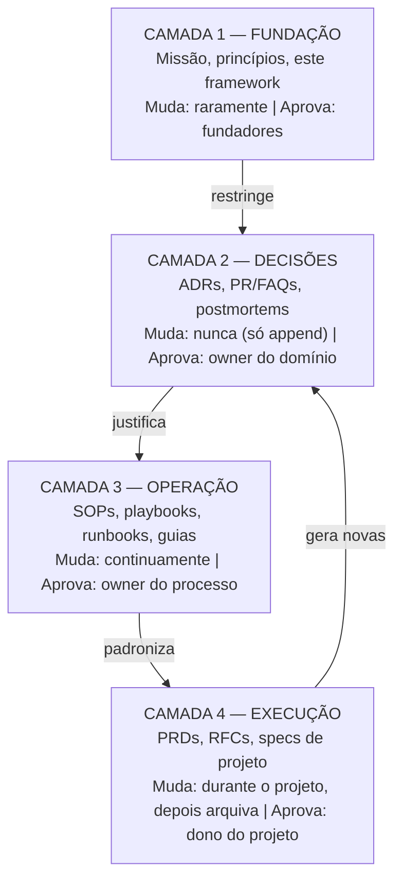
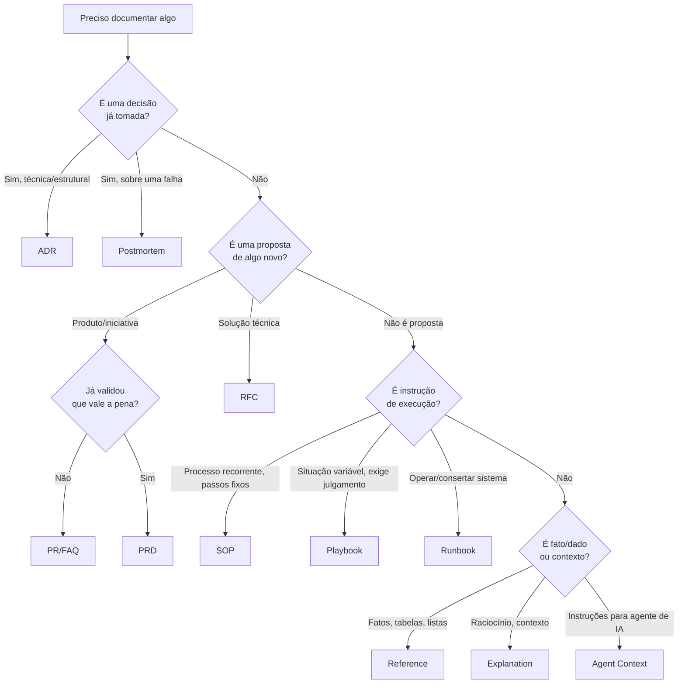
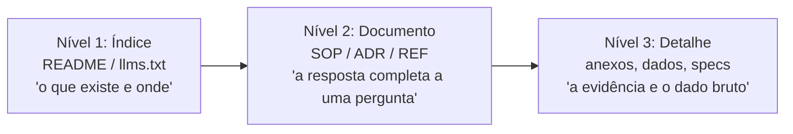
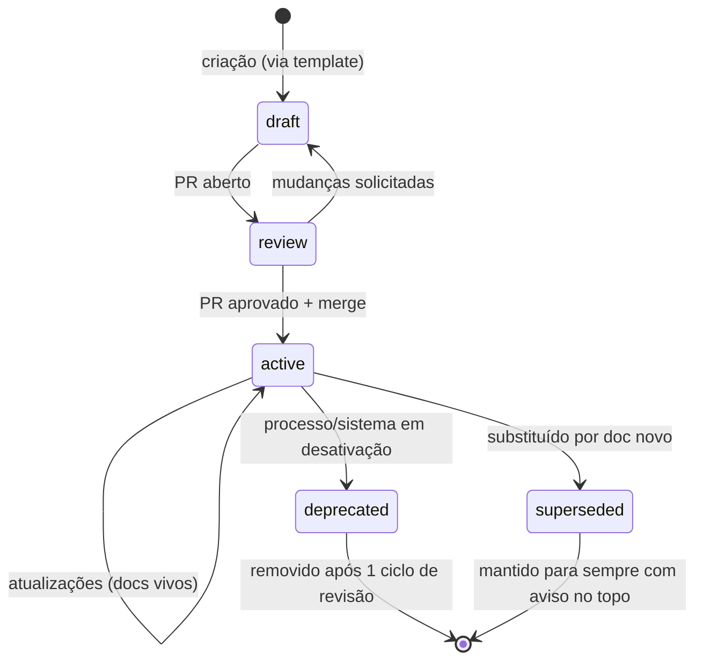

# Documentation Framework v1

> **Propósito deste documento:** definir como todo documento da empresa é escrito, estruturado, versionado, organizado e mantido. Este é o documento raiz do Company OS. Todos os demais documentos derivam suas regras daqui.
>
> **Regra de precedência:** em caso de conflito entre este framework e qualquer outro documento, este framework prevalece — exceto se o outro documento for um ADR aprovado que explicitamente substitui uma seção daqui.

---

## Sumário

1. [Princípios Fundamentais](#1-princípios-fundamentais)
2. [Arquitetura de Informação](#2-arquitetura-de-informação)
3. [Taxonomia de Documentos](#3-taxonomia-de-documentos)
4. [Estrutura Obrigatória de Todo Documento](#4-estrutura-obrigatória-de-todo-documento)
5. [Convenções](#5-convenções)
6. [Organização de Diretórios](#6-organização-de-diretórios)
7. [Modularização](#7-modularização)
8. [Versionamento e Ciclo de Vida](#8-versionamento-e-ciclo-de-vida)
9. [Como Escrever Cada Tipo de Documento](#9-como-escrever-cada-tipo-de-documento)
   - 9.1 [ADR — Architecture Decision Record](#91-adr--architecture-decision-record)
   - 9.2 [PRD — Product Requirements Document](#92-prd--product-requirements-document)
   - 9.3 [SOP — Standard Operating Procedure](#93-sop--standard-operating-procedure)
   - 9.4 [Playbook](#94-playbook)
   - 9.5 [RFC / Design Doc Técnico](#95-rfc--design-doc-técnico)
   - 9.6 [Runbook](#96-runbook)
   - 9.7 [Postmortem](#97-postmortem)
   - 9.8 [PR/FAQ — Working Backwards](#98-prfaq--working-backwards)
10. [Documentação para Agentes de IA](#10-documentação-para-agentes-de-ia)
11. [Documentação Viva: Manutenção e Governança](#11-documentação-viva-manutenção-e-governança)
12. [Anti-Padrões](#12-anti-padrões)
13. [Checklist de Qualidade (Definition of Done)](#13-checklist-de-qualidade-definition-of-done)
14. [Apêndice: Origem dos Padrões](#14-apêndice-origem-dos-padrões)

---

## 1. Princípios Fundamentais

Estes princípios foram extraídos das práticas de GitLab, Stripe, Amazon, Google, ThoughtWorks, Basecamp, Linear, Shopify, Vercel e Netflix. Cada um existe por um motivo operacional, não estético.

| # | Princípio | Definição operacional | Motivo | Origem do padrão |
|---|-----------|----------------------|--------|------------------|
| P1 | **Handbook-first** | Se não está documentado no repositório, não é regra da empresa. Decisões comunicadas apenas em chat ou reunião não têm validade operacional até serem escritas. | Elimina conhecimento tribal. Em uma empresa AI-first, agentes só executam o que conseguem ler. Conversa não é contexto recuperável. | GitLab (handbook público de +2.000 páginas como single source of truth) |
| P2 | **Docs-as-code** | Documentação vive em Git, em Markdown puro, passa por Pull Request, review e CI — exatamente como código. | Ganha de graça: versionamento, diff, blame, rollback, review assíncrono e automação. Ferramentas proprietárias (Notion, Confluence) criam silos que agentes não versionam. | Google, GitLab, Vercel |
| P3 | **Escrita antes de reunião** | Toda proposta relevante nasce como documento. Reuniões (quando existirem) servem para decidir sobre documentos, nunca para substituí-los. | Escrever força raciocínio completo. Ler é mais rápido que ouvir. Amazon proíbe slides internamente por este motivo: narrativa escrita expõe lacunas de lógica que bullets escondem. | Amazon (6-pager), Basecamp (pitch escrito) |
| P4 | **Um documento, um propósito** | Cada documento responde a uma única pergunta ou cobre um único processo. Documentos que fazem duas coisas viram dois documentos. | Documentos monolíticos apodrecem por inteiro quando uma parte muda. Módulos pequenos têm ciclo de vida independente e cabem na janela de contexto de um agente. | Diátaxis, Linear (issues atômicas aplicadas a docs) |
| P5 | **Decisões são imutáveis; estado é mutável** | Registros de decisão (ADRs, postmortems) nunca são editados após aprovação — são substituídos por novos registros. Documentos de estado (SOPs, guias) são continuamente atualizados. | Preserva o histórico de *por que* a empresa é como é. Editar uma decisão antiga destrói o raciocínio que a justificou e engana leitores futuros (humanos e agentes). | Michael Nygard / ThoughtWorks (ADRs) |
| P6 | **Escreva para o leitor de daqui a 2 anos** | Zero dependência de contexto implícito. Nomes de projetos, siglas e referências temporais ("recentemente", "o novo sistema") são proibidos sem definição. | O leitor futuro — humano novo ou agente sem memória de sessão — não estava na conversa. Documentação com contexto implícito é inútil para ambos. | Stripe (cultura de escrita), Google (design docs) |
| P7 | **Metadados são obrigatórios** | Todo documento tem frontmatter estruturado (YAML) legível por máquina: id, tipo, status, owner, datas. | Permite automação: detectar docs vencidos, gerar índices, rotear agentes para o documento certo sem leitura completa. Documento sem metadado é invisível para o sistema. | Convenção docs-as-code + llms.txt |
| P8 | **Frescor tem SLA** | Todo documento declara seu ciclo de revisão (`review_cycle`). Documento vencido é tratado como bug. | Documentação obsoleta é pior que ausente: humanos desconfiam, agentes executam instruções erradas com confiança. Pesquisas sobre agentes mostram correlação forte entre frescor e qualidade de execução. | GitLab (page ownership), Netflix (context over control) |
| P9 | **Contexto mínimo suficiente** | Documentos para agentes contêm apenas o que o agente não consegue descobrir sozinho: comandos exatos, convenções contraintuitivas, restrições. Nunca duplicam o que já existe em outro doc — linkam. | Cada token de contexto tem custo. Duplicação cria divergência. Estudos (ETH, 2025) mostram que arquivos de contexto inchados *pioram* a performance de agentes. | AGENTS.md spec, engenharia de contexto |
| P10 | **O padrão é público por default (dentro da empresa)** | Nenhum documento é privado sem justificativa explícita. Acesso restrito é exceção documentada, não regra. | Silos de informação criam retrabalho e decisões desalinhadas. Transparência interna é pré-requisito para agentes operarem com contexto completo. | GitLab (public by default), Netflix |

---

## 2. Arquitetura de Informação

### 2.1 O modelo em quatro camadas

Todo conhecimento da empresa pertence a exatamente uma destas camadas. A camada determina onde o documento vive, quem o aprova e com que frequência muda.



**Por quê:** sem camadas, tudo vira "um doc no repositório" e ninguém sabe o que é lei, o que é histórico e o que é rascunho. A camada define o contrato de mutabilidade do documento (P5).

### 2.2 O framework Diátaxis para conteúdo instrucional

Para documentos da Camada 3, adotamos a taxonomia Diátaxis, padrão de facto em engenharia de docs (usado por Django, Cloudflare, Gatsby):

| Quadrante | Responde a | Orientado a | Exemplo |
|-----------|-----------|-------------|---------|
| **Tutorial** | "Me ensine do zero" | Aprendizado | Onboarding de novo colaborador/agente |
| **How-to (SOP)** | "Como faço X?" | Tarefa | Como publicar um post para cliente |
| **Reference** | "Quais são os fatos?" | Informação | Tabela de acessos, glossário, design tokens |
| **Explanation** | "Por que é assim?" | Entendimento | Por que usamos este stack |

**Regra:** um documento nunca mistura quadrantes. Um SOP que explica história vira dois documentos: o SOP e uma explanation linkada.

**Por quê:** misturar "como fazer" com "por quê" força o executor (humano ou agente) a filtrar ruído. Separar permite que o agente carregue só o quadrante necessário para a tarefa.

---

## 3. Taxonomia de Documentos

Tipos oficiais. Criar um documento fora desta taxonomia exige adicionar o tipo a este framework primeiro (via ADR).

| Tipo | Código | Camada | Mutabilidade | Pergunta que responde | Vida útil típica |
|------|--------|--------|--------------|----------------------|------------------|
| Standard (norma) | `STD` | 1 | Versionada (semver) | "Qual é a regra?" | Anos |
| ADR | `ADR` | 2 | Imutável após aprovação | "Por que decidimos X?" | Permanente (histórico) |
| PR/FAQ | `PRF` | 2 | Imutável após aprovação | "Vale a pena construir X?" | Permanente (histórico) |
| Postmortem | `PMT` | 2 | Imutável após publicação | "O que aprendemos com a falha X?" | Permanente (histórico) |
| SOP | `SOP` | 3 | Viva (sempre atual) | "Como executo o processo X?" | Enquanto o processo existir |
| Playbook | `PLB` | 3 | Viva | "Como respondo à situação X?" | Enquanto a situação for possível |
| Runbook | `RUN` | 3 | Viva | "Como opero/conserto o sistema X?" | Enquanto o sistema existir |
| Reference | `REF` | 3 | Viva | "Quais são os dados/fatos de X?" | Enquanto for verdade |
| Explanation | `EXP` | 3 | Viva | "Por que X é assim?" | Enquanto for relevante |
| PRD | `PRD` | 4 | Viva durante projeto → arquivada | "O que vamos construir e por quê?" | Duração do projeto |
| RFC / Design Doc | `RFC` | 4 | Viva durante discussão → congelada | "Como vamos construir X?" | Duração do projeto |
| Agent Context | `AGT` | 3 | Viva | "O que um agente precisa saber aqui?" | Enquanto o diretório existir |

### Árvore de decisão: qual documento escrever?



---

## 4. Estrutura Obrigatória de Todo Documento

### 4.1 Frontmatter (obrigatório, legível por máquina)

Todo arquivo `.md` do repositório começa com este bloco YAML. Campos marcados com * são obrigatórios.

```yaml
---
id: SOP-MKT-004          # *Código único: TIPO-DOMÍNIO-SEQUENCIAL
title: Publicação de conteúdo para cliente   # *Título humano
type: sop                # *Tipo da taxonomia (minúsculo)
status: active           # *draft | review | active | deprecated | superseded
version: 2.1.0           # *Semver (ver §8)
owner: content-ops       # *Time ou papel responsável (nunca nome de pessoa)
created: 2026-03-14      # *Data de criação (ISO 8601)
last_reviewed: 2026-06-30 # *Última revisão de frescor
review_cycle: 90d        # *SLA de revisão: 30d | 90d | 180d | 365d
supersedes: SOP-MKT-002  # ID do doc substituído, ou "none"
superseded_by: none      # Preenchido quando este doc for substituído
audience: [humans, ai-agents]  # *Quem consome
related: [PLB-MKT-001, REF-MKT-003]  # IDs de docs relacionados
tags: [content, client-delivery]
---
```

**Por que cada campo existe:**

- `id` — permite referência estável mesmo se o arquivo for movido ou renomeado. Links por ID não quebram.
- `owner` como papel, não pessoa — pessoas saem; papéis permanecem. Evita docs órfãos.
- `review_cycle` + `last_reviewed` — permite que um script (ou agente) liste todos os documentos vencidos automaticamente. É o mecanismo que torna P8 executável, não aspiracional.
- `supersedes` / `superseded_by` — cria a cadeia de proveniência. Um agente que encontra um doc `superseded` sabe exatamente para onde ir.
- `audience` — permite gerar automaticamente o índice para agentes (ver §10) filtrando `ai-agents`.

### 4.2 Corpo mínimo obrigatório

Independente do tipo, todo documento tem, nesta ordem:

1. **Título H1** — único H1 do documento, idêntico ao `title` do frontmatter.
2. **Bloco de propósito** — 1 a 3 frases em blockquote: o que este documento é, para quem, e quando usá-lo. Se o leitor errado abriu o doc, ele descobre na primeira linha.
3. **Sumário** — obrigatório para documentos com mais de 5 seções ou 300 linhas.
4. **Corpo** — conforme o template do tipo (§9).
5. **Seção `## Referências`** — links para docs relacionados, por ID. Nunca duplicar conteúdo que pode ser linkado (P9).
6. **Seção `## Changelog`** — apenas em documentos vivos (Camada 3): lista de mudanças materiais com data e versão. Documentos imutáveis não têm changelog (o Git é o changelog do rascunho; após aprovação, não há mudanças).

---

## 5. Convenções

### 5.1 Nomenclatura de arquivos

| Regra | Formato | Exemplo | Motivo |
|-------|---------|---------|--------|
| Tudo minúsculo, kebab-case | `nome-do-documento.md` | `publicacao-conteudo-cliente.md` | Evita quebra de links em sistemas case-sensitive; padrão de URLs |
| ADRs numerados com 4 dígitos | `NNNN-titulo.md` | `0007-monorepo-unico.md` | Ordenação cronológica natural no filesystem; o número nunca é reutilizado |
| Sem datas no nome de docs vivos | — | ❌ `sop-2026-publicacao.md` | Data no nome sinaliza obsolescência; a data vive no frontmatter |
| Datas apenas em docs imutáveis datados | `YYYY-MM-DD-titulo.md` | `2026-07-02-falha-deploy-site.md` (postmortem) | O evento é datado por natureza |
| Idioma dos nomes: inglês para estrutura, português permitido no conteúdo | — | `sops/`, `decisions/` | Compatibilidade com tooling e agentes; conteúdo segue a língua de trabalho |
| Um `README.md` por diretório | — | `sops/README.md` | Todo diretório se auto-explica: o que contém, para quem, índice |

### 5.2 Títulos e hierarquia de headings

- **Um único H1 por documento** (o título). Motivo: parsers, geradores de índice e agentes usam H1 como identidade do documento.
- **Headings são frases funcionais, não rótulos vagos.** ❌ "Considerações" → ✅ "Restrições de orçamento que limitam esta decisão". Motivo: o heading deve ser útil isolado, num sumário ou num resultado de busca.
- **Nunca pular níveis** (H2 → H4). Motivo: quebra a árvore semântica que agentes usam para navegar.
- **Profundidade máxima: H4.** Se precisa de H5, o documento precisa ser dividido (P4).

### 5.3 Escrita

| Regra | Motivo |
|-------|--------|
| Voz ativa, presente do indicativo: "O agente publica o post", não "O post deverá ser publicado" | Ambiguidade zero sobre quem faz o quê — crítico para agentes |
| Uma instrução por frase em documentos executáveis | Agentes seguem instruções atômicas com mais precisão; humanos escaneiam mais rápido |
| Comandos, caminhos e nomes de arquivo sempre em `code` | Agentes copiam literalmente; formatação distingue o executável do descritivo |
| Toda sigla é definida na primeira ocorrência de cada documento | O leitor pode chegar por busca direto na seção 7 |
| Proibido: "recentemente", "atualmente", "o novo X", "como discutido" | Referências temporais e conversacionais apodrecem (P6) |
| Números e limites sempre explícitos: "responda em até 4h úteis", não "responda rapidamente" | "Rapidamente" não é executável nem auditável |
| Links internos sempre por caminho relativo do repo + ID no texto | `[SOP-MKT-004](../sops/marketing/publicacao-conteudo-cliente.md)` sobrevive a forks e clones |

### 5.4 Tabelas, exemplos e diagramas

- **Tabela quando há 3+ itens com 2+ atributos.** Prosa para raciocínio, tabela para dados.
- **Todo conceito abstrato ganha um exemplo concreto.** Um exemplo real vale mais que três parágrafos de descrição — e agentes generalizam melhor a partir de exemplos do que de regras abstratas.
- **Diagramas sempre em Mermaid, nunca imagem.** Motivo: Mermaid é texto — versionável, diffável, editável por agente. Uma imagem PNG de diagrama é um beco sem saída de manutenção.
- **Exemplos negativos acompanham positivos** onde houver erro comum: ❌ / ✅.

---

## 6. Organização de Diretórios

Estrutura raiz do repositório `company-os`:

```text
company-os/
├── README.md                  # Porta de entrada humana: o que é este repo, como navegar
├── AGENTS.md                  # Porta de entrada de agentes (ver §10)
├── llms.txt                   # Índice navegável para LLMs (ver §10)
│
├── 00-foundation/             # CAMADA 1 — muda raramente
│   ├── README.md
│   ├── mission.md
│   ├── principles.md
│   ├── documentation-framework.md   # ← este documento
│   └── glossary.md            # REF: vocabulário canônico da empresa
│
├── 01-decisions/              # CAMADA 2 — append-only
│   ├── README.md              # índice de ADRs com status
│   ├── adr/
│   │   ├── 0001-monorepo-para-company-os.md
│   │   ├── 0002-stack-de-ia-por-funcao.md
│   │   └── ...
│   ├── prfaq/
│   └── postmortems/
│       └── 2026-07-02-falha-deploy-site.md
│
├── 02-operations/             # CAMADA 3 — viva
│   ├── README.md
│   ├── sops/
│   │   ├── README.md          # índice por domínio
│   │   ├── marketing/
│   │   ├── sales/
│   │   ├── finance/
│   │   └── engineering/
│   ├── playbooks/
│   ├── runbooks/
│   ├── reference/             # tabelas, acessos, design tokens, ICPs
│   └── explanations/
│
├── 03-projects/               # CAMADA 4 — viva → arquivada
│   ├── README.md
│   ├── active/
│   │   └── <projeto>/
│   │       ├── prd.md
│   │       ├── rfc-001-arquitetura.md
│   │       └── AGENTS.md      # contexto local do projeto
│   └── archive/               # projetos encerrados, imutáveis
│
├── 04-templates/              # templates canônicos de cada tipo
│   ├── adr.md
│   ├── prd.md
│   ├── sop.md
│   ├── playbook.md
│   ├── rfc.md
│   ├── runbook.md
│   ├── postmortem.md
│   └── prfaq.md
│
└── .github/
    └── workflows/
        └── docs-ci.yml        # lint, link-check, verificação de frontmatter e frescor
```

**Decisões de design desta árvore e seus motivos:**

1. **Prefixos numéricos (`00-`, `01-`)** — a ordem no filesystem espelha a hierarquia de camadas. Quem (ou o que) abre o repo entende a precedência sem ler nada.
2. **Profundidade máxima: 3 níveis abaixo da raiz.** Cada nível extra é um lugar a mais para um documento se perder. Se um diretório precisa de um 4º nível, o domínio deve virar um diretório de 2º nível.
3. **`templates/` como diretório de primeira classe** — criar documento novo é copiar um template, nunca escrever do zero. Garante consistência estrutural sem depender de disciplina.
4. **`archive/` separado de `active/`** — agentes e buscas priorizam `active/`; o arquivo preserva histórico sem poluir o presente.
5. **Um repositório único (monorepo de conhecimento)** — enquanto a empresa for pequena, dividir conhecimento em repos cria fronteiras artificiais. Dividir é uma decisão futura que exigirá um ADR.

---

## 7. Modularização

### 7.1 Regras de tamanho e divisão

| Regra | Limite | Ação quando estourar |
|-------|--------|----------------------|
| Documento operacional (SOP, runbook) | ~300 linhas | Dividir por sub-processo; criar doc índice |
| Documento de decisão (ADR) | ~150 linhas | ADRs longos escondem decisões múltiplas: dividir em 2+ ADRs |
| AGENTS.md | ~150 linhas | Mover conteúdo para docs linkados; usar AGENTS.md aninhado por diretório |
| Reference | sem limite rígido | Tabelas longas são aceitáveis; prosa longa não |

**Motivo dos limites:** um documento deve caber confortavelmente na janela de atenção de quem o consome. Para agentes, docs inchados consomem contexto e diluem sinal; para humanos, docs longos não são lidos — são escaneados mal.

### 7.2 Progressive disclosure

O conhecimento se organiza em três níveis de profundidade, e cada nível **linka** para o seguinte em vez de embutir:



**Regra de ouro anti-duplicação:** cada fato tem exatamente **um** documento canônico. Todos os outros lugares linkam. Se você está copiando um parágrafo de um doc para outro, pare: ou o parágrafo está no lugar errado, ou você deveria estar linkando.

**Motivo:** duplicação inevitavelmente diverge. Quando duas versões do mesmo fato divergem, humanos perdem confiança e agentes escolhem a errada com 50% de chance.

---

## 8. Versionamento e Ciclo de Vida

### 8.1 Estados



Regras:

- **Nenhum documento entra em `active` sem passar por PR** com pelo menos 1 revisor humano. Em empresa AI-first isso importa em dobro: agentes geram volume; o gargalo de qualidade é o review, não a escrita.
- **Documento `superseded` recebe banner obrigatório** no topo do corpo: `> ⚠️ SUBSTITUÍDO por [ID](link). Mantido apenas como histórico.` — e o campo `superseded_by` preenchido. Motivo: um agente que chega pelo link antigo precisa ser redirecionado no primeiro parágrafo.
- **Deleção é quase proibida.** Docs saem de circulação via `deprecated`/`superseded`, não via `rm`. Deleção real só para conteúdo incorreto perigoso ou dado sensível — e exige registro no changelog do diretório.

### 8.2 Versionamento semântico de documentos

Documentos vivos usam semver no campo `version`:

| Incremento | Quando | Exemplo |
|------------|--------|---------|
| **MAJOR** (2.0.0) | Mudança que invalida a execução anterior: passos removidos, ordem alterada, ferramenta trocada | SOP migra de ferramenta A para B |
| **MINOR** (1.3.0) | Adição compatível: novo passo opcional, nova seção | Adicionado passo de QA opcional |
| **PATCH** (1.2.4) | Correção sem mudança de comportamento: typo, link, clareza | Corrigido link quebrado |

**Motivo:** quando um agente (ou um SOP de outro time) referencia "SOP-MKT-004 v2.x", a distinção major/minor comunica se a dependência quebrou. O Git guarda o histórico linha a linha; o semver comunica o **significado** da mudança.

### 8.3 O que o Git resolve e o que ele não resolve

O Git é a fonte de verdade do histórico (quem mudou o quê, quando). Mas Git **não** comunica intenção nem estado. Por isso:

- `git log` = auditoria forense.
- Frontmatter (`status`, `version`) = estado atual legível sem abrir o histórico.
- `## Changelog` no corpo = mudanças **materiais** curadas para o leitor (não cada commit).

---

## 9. Como Escrever Cada Tipo de Documento

Cada subseção define: quando usar, princípios de escrita e o template canônico (que vive em `04-templates/`).

### 9.1 ADR — Architecture Decision Record

**Quando usar:** qualquer decisão estrutural difícil de reverter — técnica, de ferramenta, de processo ou organizacional. Teste rápido: *"daqui a 1 ano alguém vai perguntar 'por que fizemos assim?'"* Se sim, é um ADR. Decisões triviais e reversíveis (Amazon: "two-way doors") não geram ADR — geram no máximo uma linha no changelog do doc afetado.

**Princípios:**

1. **Um ADR = uma decisão.** Se o título tem "e", são dois ADRs.
2. **O contexto é a parte mais valiosa.** A decisão em si envelhece; o registro das forças em jogo (restrições, alternativas, trade-offs) é o que permite ao leitor futuro decidir se o contexto mudou o suficiente para revisitar.
3. **Alternativas rejeitadas são obrigatórias, com o motivo da rejeição.** Sem elas, a decisão parece arbitrária e será re-litigada eternamente.
4. **Consequências negativas são obrigatórias.** Toda decisão tem custo. ADR sem seção "consequências negativas" preenchida está incompleto — é o teste de honestidade do documento.
5. **Imutável após aceito.** Para mudar: novo ADR com `supersedes` apontando para o antigo.

**Template (`04-templates/adr.md`):**

```markdown
---
id: ADR-0007
title: <Decisão em uma frase afirmativa>
type: adr
status: active          # draft | review | active | superseded
version: 1.0.0
owner: <domínio>
created: <data>
last_reviewed: <data>
review_cycle: 365d
supersedes: none
superseded_by: none
audience: [humans, ai-agents]
---

# ADR-0007: <Decisão em uma frase afirmativa>

> Decisão sobre <tema>. Leia se você vai trabalhar em <área afetada>.

## Contexto
<Forças em jogo: o problema, restrições (prazo, custo, capacidade),
o que muda se não decidirmos. Fatos, não opiniões. 2-4 parágrafos.>

## Decisão
<"Nós vamos..." — presente, voz ativa, uma frase de decisão +
detalhamento mínimo do escopo. O que está DENTRO e o que está FORA.>

## Alternativas consideradas
### Alternativa A: <nome>
- Prós: ...
- Contras: ...
- Rejeitada porque: <motivo específico, não genérico>

### Alternativa B: <nome>
- ...

## Consequências
### Positivas
- ...
### Negativas (obrigatório preencher)
- ...
### Neutras / a monitorar
- <sinais que indicariam que esta decisão deve ser revisitada>

## Referências
- <ADRs relacionados, RFCs, dados que embasaram>
```

**Exemplo de título bom vs. ruim:**
❌ `ADR-0003: Banco de dados` → ✅ `ADR-0003: Usar Postgres gerenciado como único banco até 10k usuários`

---

### 9.2 PRD — Product Requirements Document

**Quando usar:** antes de construir qualquer produto, feature ou entregável não-trivial. O PRD define **o problema e o resultado esperado** — nunca a solução técnica (isso é o RFC).

**Princípios:**

1. **Problema antes de solução.** A seção de problema deve sobreviver mesmo que a solução proposta seja descartada. Se o PRD só faz sentido com a solução já escolhida, ele é um RFC disfarçado.
2. **Sucesso é mensurável ou não é sucesso.** Toda meta tem número, prazo e fonte de medição.
3. **Non-goals são tão importantes quanto goals.** A lista do que **não** será feito é a principal defesa contra scope creep — e a instrução mais valiosa para um agente executor, que por padrão tende a fazer mais do que o pedido.
4. **Curto.** Um PRD de referência tem 1-3 páginas (padrão Linear/Basecamp), não 15 (padrão corporativo tradicional). Detalhe demais no PRD é decisão de design tomada cedo demais.

**Template (seções obrigatórias):**

```markdown
# PRD: <nome do projeto>

## Problema
<Quem sofre, o que sofre, evidência de que sofre. Sem mencionar a solução.>

## Por que agora
<Custo de não fazer; janela de oportunidade; dependências.>

## Resultado esperado (métricas de sucesso)
| Métrica | Baseline | Meta | Prazo | Fonte de medição |
|---------|----------|------|-------|------------------|

## Escopo
### Goals
### Non-goals (obrigatório)

## Usuários e casos de uso
<Persona → situação → o que consegue fazer que antes não conseguia.>

## Restrições
<Orçamento, prazo, técnicas, legais.>

## Riscos e questões em aberto
| Risco/Questão | Impacto | Dono | Status |

## Apetite (Shape Up)
<Quanto tempo/recurso este problema MERECE — teto, não estimativa.
Se não couber no apetite, corta-se escopo, não se estende prazo.>
```

**Por que "apetite" e não "estimativa":** estimativas crescem para acomodar o escopo; apetite força o escopo a caber no valor que o problema tem. É o mecanismo do Basecamp para impedir projetos zumbis.

---

### 9.3 SOP — Standard Operating Procedure

**Quando usar:** processo **recorrente** com passos **determinísticos**. Se o executor precisa de julgamento significativo entre os passos, não é SOP — é playbook.

**Princípios:**

1. **Escrito para execução literal.** O teste de qualidade de um SOP: *um agente de IA sem nenhum outro contexto consegue executá-lo do início ao fim?* Se a resposta é não, o SOP tem lacunas.
2. **Toda etapa tem: ação, executor, ferramenta, critério de conclusão.** "Revisar o texto" é inválido. "Revisar o texto contra o checklist REF-MKT-009; aprovado = zero itens vermelhos" é válido.
3. **Pré-condições e resultado final explícitos.** O que precisa ser verdade antes de começar; o que é verdade quando termina (definition of done do processo).
4. **Caminho de exceção.** Todo SOP declara o que fazer quando um passo falha: quem acionar, o que registrar, quando abortar.

**Template:**

```markdown
# SOP: <nome do processo>

> Executa <resultado> sempre que <gatilho>. Executor: <papel ou agente>.

## Gatilho
<O evento exato que inicia este processo.>

## Pré-condições
- [ ] <acesso, insumo ou estado necessário>

## Passos
### 1. <Verbo no infinitivo + objeto>
- **Executor:** <papel/agente>
- **Ferramenta:** <nome + link>
- **Ação:** <instrução literal, comandos em `code`>
- **Concluído quando:** <critério verificável>

### 2. ...

## Exceções
| Se acontecer | Então | Escalar para |
|--------------|-------|--------------|

## Resultado final (definition of done)
- [ ] <estado verificável do mundo após o processo>

## Frequência e SLA
<Com que frequência roda; tempo máximo de execução.>

## Changelog
```

---

### 9.4 Playbook

**Quando usar:** situações **variáveis** que exigem **julgamento dentro de limites definidos**: responder a um cliente insatisfeito, negociar proposta, reagir a uma oportunidade de conteúdo. O playbook não dita passos — dita **princípios de decisão, cenários e limites**.

**Diferença estrutural SOP × Playbook:**

| | SOP | Playbook |
|--|-----|----------|
| Natureza da situação | Idêntica toda vez | Variável |
| Formato central | Sequência de passos | Cenários + regras de decisão |
| Liberdade do executor | Zero (execução literal) | Alta, dentro de guard-rails |
| Teste de qualidade | Agente executa sem contexto extra | Executor decide bem em cenário não previsto |

**Princípios:**

1. **Organize por cenário, não por passo.** "Se o cliente reclama de prazo → ...", "Se reclama de preço → ...".
2. **Explicite os limites inegociáveis (guard-rails).** O que o executor **nunca** pode fazer sem escalar (ex.: "nunca prometer prazo sem confirmar capacidade; nunca dar desconto acima de 10% sem aprovação"). Para agentes de IA, guard-rails são a seção mais importante do documento.
3. **Inclua o raciocínio, não só a regra.** Diferente do SOP, o playbook ensina o *porquê* — é isso que permite generalizar para o cenário não previsto (princípio Netflix: contexto em vez de controle).
4. **Exemplos reais anonimizados.** Um caso real bem narrado calibra julgamento melhor que dez regras.

**Template:**

```markdown
# Playbook: <situação>

> Como responder quando <situação>. Para <papel/agente>.

## Objetivo da resposta
<O resultado que toda variação deve buscar.>

## Princípios de decisão
1. <princípio + por quê>

## Guard-rails (inegociáveis)
- NUNCA <ação> sem <condição/aprovação>.

## Cenários
### Cenário A: <descrição>
- **Sinais:** <como reconhecer>
- **Resposta recomendada:** ...
- **Erro comum:** ...

## Escalação
| Situação | Escalar para | Prazo |

## Casos reais (anonimizados)

## Changelog
```

---

### 9.5 RFC / Design Doc Técnico

**Quando usar:** antes de implementar qualquer solução técnica não-trivial (padrão Google/Stripe: se leva mais de ~1 semana para construir ou é difícil de reverter, escreva o design primeiro).

**Princípios:**

1. **O RFC existe para ser criticado antes do código existir.** Mudar um parágrafo custa minutos; mudar um sistema custa semanas. O documento circula em `review` com prazo explícito de comentários (ex.: 72h) — silêncio após o prazo = consentimento.
2. **Comece pelo problema e pelas restrições**, herdados do PRD (linkar, não repetir).
3. **"Alternativas consideradas" obrigatória**, mesma lógica do ADR.
4. **Declare o plano de rollback.** Toda mudança descreve como é desfeita. Se não há rollback possível, isso é dito explicitamente — e muda o rigor do review.
5. **Congela após aprovação.** O RFC aprovado vira registro histórico; mudanças de rumo durante a implementação geram adendo datado (`## Adendo 2026-08-01`), nunca edição silenciosa.

**Seções obrigatórias:** Contexto e problema (link ao PRD) → Proposta → Detalhamento técnico → Alternativas consideradas → Riscos e mitigações → Plano de implementação e rollback → Questões em aberto.

---

### 9.6 Runbook

**Quando usar:** operação e recuperação de um **sistema** específico (site, automação, integração, pipeline de conteúdo).

**Princípios:**

1. **Escrito para ser lido durante um incidente**, possivelmente às 2h da manhã, possivelmente por um agente. Portanto: zero prosa, máximo comando literal, diagnóstico antes de correção.
2. **Estrutura sintoma → diagnóstico → correção.** O leitor chega com um sintoma, não com a causa.
3. **Todo comando é copiável e testado.** Comando errado num runbook é pior que ausência de runbook.
4. **Inclui "como saber que voltou ao normal"** — critério de resolução verificável.

---

### 9.7 Postmortem

**Quando usar:** após qualquer falha com impacto real (cliente afetado, entrega perdida, dado incorreto publicado, agente executando ação errada em produção).

**Princípios:**

1. **Blameless por design.** O documento nomeia sistemas, processos e lacunas de contexto — nunca culpa indivíduos (nem agentes específicos). Motivo: cultura de culpa esconde falhas; falhas escondidas se repetem. Padrão Google SRE/Etsy.
2. **Linha do tempo factual** com timestamps: o que aconteceu, quando foi detectado, quando foi mitigado.
3. **Causa raiz via "5 porquês"** — parar no primeiro "porquê" gera correção cosmética.
4. **Toda ação corretiva tem dono e prazo** e vira item rastreado. Postmortem sem ações é terapia, não engenharia.
5. **Em empresa AI-first:** todo postmortem inclui a seção *"Que contexto faltou ao agente/pessoa?"* — na maioria das falhas com agentes, a causa raiz é documentação ausente, ambígua ou obsoleta. O postmortem é o mecanismo que realimenta o Company OS.

---

### 9.8 PR/FAQ — Working Backwards

**Quando usar:** antes de investir em qualquer produto ou iniciativa nova de porte. Precede o PRD.

**Formato (Amazon):**

1. **Press Release fictício (1 página):** escrito como se o produto já tivesse sido lançado, na linguagem do cliente. Título, problema do cliente, o que o produto faz, citação fictícia de cliente satisfeito.
2. **FAQ (2-4 páginas):** as perguntas mais difíceis — internas (custo, risco, capacidade) e externas (preço, diferencial) — com respostas honestas.

**Por que funciona:** força clareza sobre o valor para o cliente **antes** de qualquer entusiasmo com a solução. Se o press release fictício não é empolgante, o produto real também não será — e você descobriu isso pelo custo de uma página.

---

## 10. Documentação para Agentes de IA

Esta seção define como o Company OS serve agentes (Claude, Cowork, agentes de código, automações). Baseia-se no padrão aberto AGENTS.md (Linux Foundation / Agentic AI Foundation) e no padrão llms.txt, mais evidências recentes de engenharia de contexto.

### 10.1 Arquivos de contexto

| Arquivo | Local | Função |
|---------|-------|--------|
| `AGENTS.md` | Raiz do repo + raiz de cada projeto em `03-projects/active/` | Briefing operacional do agente: comandos, convenções, guard-rails |
| `CLAUDE.md` | Symlink → `AGENTS.md` | Compatibilidade com Claude Code sem duplicar conteúdo |
| `llms.txt` | Raiz do repo | Índice navegável: lista os documentos canônicos com uma linha de descrição cada, para o agente descobrir o que existe antes de ler |

**Regra de aninhamento:** o `AGENTS.md` mais próximo do arquivo em edição prevalece. O da raiz contém o global; cada projeto contém só o local.

### 10.2 Princípios de conteúdo para AGENTS.md

Estes princípios vêm de evidência empírica (estudo ETH 2025 sobre arquivos de contexto; análise do GitHub sobre 2.500+ repositórios):

1. **≤150 linhas. Cada token é carregado em toda requisição**, relevante ou não. Arquivo inchado dilui sinal e aumenta custo.
2. **Só o que o agente não descobre sozinho:** comandos exatos, convenções contraintuitivas, restrições, vocabulário de domínio. **Não** incluir: visão geral de arquitetura, descrições do que está óbvio na estrutura de pastas, conteúdo que já existe em outro doc (linkar).
3. **Documentação gerada por LLM sem curadoria humana é proibida neste arquivo.** O estudo ETH mostrou que arquivos de contexto gerados automaticamente *pioraram* a performance em 5 de 8 cenários. Todo AGENTS.md passa por review humano como qualquer código.
4. **Staleness envenena.** Doc obsoleto para humano é irritante; para agente, é instrução errada executada com confiança. AGENTS.md tem `review_cycle: 30d` — o mais curto do sistema.
5. **Guard-rails em hierarquia explícita:** NUNCA (inviolável) > SEMPRE (padrão obrigatório) > PREFIRA (default com exceções). Agentes resolvem conflitos entre regras melhor quando a prioridade é declarada.
6. **Um exemplo real > três parágrafos de descrição.**

**Esqueleto do `AGENTS.md` raiz:**

```markdown
# Company OS — Contexto para Agentes

Este repositório é o sistema operacional da empresa. Estrutura: camadas
00 (fundação) → 01 (decisões) → 02 (operação) → 03 (projetos).

## Antes de qualquer tarefa
1. Leia `llms.txt` para localizar os documentos relevantes.
2. Verifique `status` e `last_reviewed` no frontmatter. Doc `superseded`
   ou vencido: siga o link em `superseded_by` ou sinalize antes de usar.

## Regras (em ordem de prioridade)
- NUNCA edite documentos em `01-decisions/` com status `active`.
- NUNCA faça merge sem review humano.
- SEMPRE crie documentos copiando de `04-templates/`.
- SEMPRE preencha o frontmatter completo.
- PREFIRA editar o doc canônico a criar um doc novo.

## Convenções
- Arquivos: kebab-case. IDs: TIPO-DOMÍNIO-NNN. Idioma: pt-BR no conteúdo.
- Commits: `docs(<área>): <mudança>` — ex.: `docs(sops): adiciona passo de QA`

## Vocabulário
- <termo do domínio>: <definição de uma linha> (completo em glossary.md)
```

### 10.3 Escrever para dupla audiência

Todo documento `audience: [humans, ai-agents]` segue as regras de §5.3 com rigor extra: instruções atômicas, critérios verificáveis, comandos literais, zero ambiguidade de executor. Na prática, **escrever para agentes melhora o documento para humanos** — as duas audiências convergem. Quando divergem (ex.: contexto motivacional útil para humanos, ruído para agentes), o conteúdo divergente vai para um `EXP` linkado.

---

## 11. Documentação Viva: Manutenção e Governança

Documentação morre por entropia, não por decisão. Este capítulo define os mecanismos — não intenções — que impedem isso.

### 11.1 Ownership

- **Todo documento tem exatamente um `owner`** (papel, não pessoa). Owner responde por: exatidão, frescor dentro do `review_cycle`, e triagem de PRs sobre o doc.
- **Doc sem owner válido é bug P1 do Company OS:** entra na fila de triagem semanal para adoção ou depreciação.

### 11.2 Cadência de revisão (o mecanismo do SLA de frescor)

1. CI roda semanalmente e lista todo doc com `last_reviewed + review_cycle < hoje`.
2. Docs vencidos geram issue automática atribuída ao owner.
3. Revisar = reler, corrigir ou confirmar exatidão, e atualizar `last_reviewed`. Confirmação sem leitura é violação do framework.
4. Doc vencido há mais de 2 ciclos é automaticamente marcado `deprecated` — melhor sem doc do que com doc mentiroso.

### 11.3 Docs no Definition of Done

Nenhuma mudança de processo, ferramenta ou sistema está concluída até o documento correspondente estar atualizado **no mesmo PR ou no PR imediatamente vinculado**. "Depois eu documento" = a mudança não terminou. Este é o único mecanismo que mantém docs e realidade sincronizados sem esforço heroico.

### 11.4 CI de documentação (`docs-ci.yml`)

| Check | Falha quando |
|-------|--------------|
| Frontmatter lint | Campo obrigatório ausente ou inválido |
| Link check | Link interno quebrado |
| Naming lint | Arquivo fora do padrão kebab-case / numeração ADR |
| Heading lint | Mais de um H1; níveis pulados |
| Freshness report (semanal) | Doc vencido (gera issue, não bloqueia PR) |
| Mermaid parse | Diagrama com sintaxe inválida |

### 11.5 Como mudar este framework

Este documento é `STD` versionado. Mudanças estruturais (nova camada, novo tipo, mudança de frontmatter) exigem ADR + bump de MAJOR. Correções e clarificações: PR normal + MINOR/PATCH.

---

## 12. Anti-Padrões

| Anti-padrão | Por que destrói o sistema | Correção |
|-------------|---------------------------|----------|
| **Doc-tumba**: escrever e nunca revisar | Vira mentira com aparência de verdade; agentes executam a mentira | `review_cycle` + CI (§11.2) |
| **Duplicação "por conveniência"** | Duas fontes divergem; confiança no sistema inteiro cai | Link por ID; um fato, um doc canônico (§7.2) |
| **Decisão editada em silêncio** | Apaga o raciocínio histórico; re-litigação eterna | Imutabilidade + `supersedes` (P5, §9.1) |
| **Doc-romance**: contexto, história e instrução misturados | Ninguém acha a instrução; agente carrega ruído | Diátaxis: separar quadrantes (§2.2) |
| **Conhecimento em chat/reunião** | Irrecuperável, não versionado, invisível para agentes | Handbook-first (P1) |
| **Frontmatter decorativo**: preencher e nunca usar | Metadado errado é pior que ausente | CI valida; freshness report usa (§11.4) |
| **Template ignorado "porque este caso é diferente"** | Cada exceção estrutural quebra parsers, índices e expectativas | Casos realmente novos mudam o template via PR, não o ignoram |
| **AGENTS.md enciclopédico** | Dilui sinal, queima contexto, degrada performance do agente | ≤150 linhas + progressive disclosure (§10.2) |
| **Screenshot de ferramenta como instrução** | Apodrece a cada release da ferramenta; agente não lê pixel | Descrever a ação, não a interface; Mermaid para fluxos |

---

## 13. Checklist de Qualidade (Definition of Done)

Antes de mover qualquer documento para `review`, o autor (humano ou agente) verifica:

**Estrutura**
- [ ] Criado a partir do template de `04-templates/`
- [ ] Frontmatter completo e válido
- [ ] Um único H1, idêntico ao `title`
- [ ] Bloco de propósito nas 3 primeiras linhas do corpo
- [ ] Sumário (se >5 seções ou >300 linhas)

**Conteúdo**
- [ ] Responde a exatamente uma pergunta (P4)
- [ ] Zero referências temporais ou conversacionais ("recentemente", "como discutido")
- [ ] Toda sigla definida na primeira ocorrência
- [ ] Instruções com executor, ferramenta e critério de conclusão explícitos
- [ ] Alternativas rejeitadas e consequências negativas presentes (ADR/RFC)
- [ ] Nenhum conteúdo duplicado de outro doc — apenas links por ID

**Sistema**
- [ ] Links internos funcionam (CI valida)
- [ ] Docs relacionados listados em `related` e `## Referências`
- [ ] Se substitui um doc: `supersedes` preenchido aqui, `superseded_by` + banner no doc antigo

**Teste final (o mais importante)**
- [ ] *Um agente de IA sem nenhum contexto além deste documento e dos seus links consegue usá-lo corretamente?*
- [ ] *Um humano contratado daqui a 2 anos entende este documento sem perguntar nada a ninguém?*

Se qualquer resposta for "não", o documento não está pronto.

---

## 14. Apêndice: Origem dos Padrões

Rastreabilidade dos princípios deste framework para as práticas que os inspiraram:

| Prática adotada | Empresa/fonte de origem | O que extraímos (princípio, não cópia) |
|-----------------|------------------------|----------------------------------------|
| Handbook como single source of truth | GitLab | Se não está escrito, não é regra (P1) |
| Narrativa escrita antes de decisão; PR/FAQ | Amazon | Escrever força raciocínio; trabalhar de trás para frente (P3, §9.8) |
| Design docs com alternativas e review assíncrono | Google | Criticar o documento é mais barato que criticar o sistema (§9.5) |
| ADRs leves e imutáveis | ThoughtWorks / Michael Nygard | Decisão é registro histórico, não estado (P5, §9.1) |
| Postmortem blameless | Google SRE / Netflix / Etsy | Culpar esconde falhas; sistemas falham, não pessoas (§9.7) |
| Apetite em vez de estimativa; pitch escrito | Basecamp (Shape Up) | Escopo cabe no valor do problema (§9.2) |
| Especificação mínima, escrita opinativa e curta | Linear (Linear Method) | PRD de 1-3 páginas; velocidade vem de clareza, não de volume (§9.2) |
| Docs-as-code, docs versionadas com o produto | Vercel / Stripe | Documentação passa por PR, CI e review como código (P2) |
| Contexto em vez de controle | Netflix | Playbooks ensinam o porquê para permitir julgamento (§9.4) |
| Diátaxis (tutorial/how-to/reference/explanation) | Divio / comunidade de docs | Um documento, um modo de leitura (§2.2) |
| AGENTS.md / llms.txt / contexto mínimo | Padrão aberto (Linux Foundation) + evidência ETH 2025 | Documentação nativa para agentes com orçamento de contexto (§10) |

---

## Referências

- `00-foundation/principles.md` — princípios gerais da empresa (quando existir)
- `04-templates/` — templates canônicos derivados deste framework

## Changelog

| Versão | Data | Mudança |
|--------|------|---------|
| 1.0.0 | 2026-07-09 | Versão inicial do framework |
